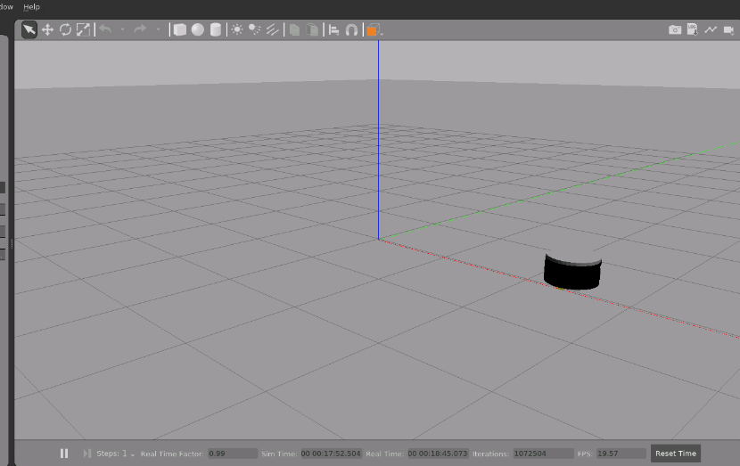
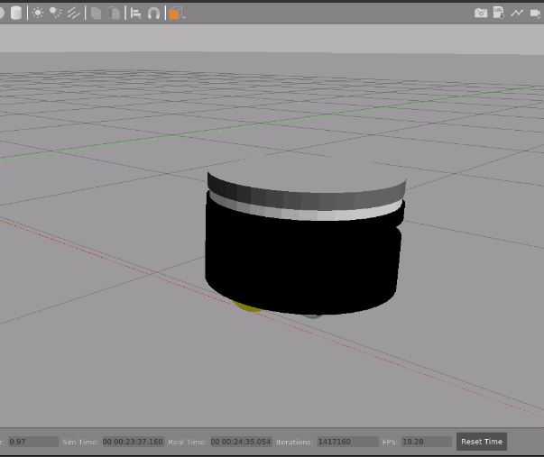
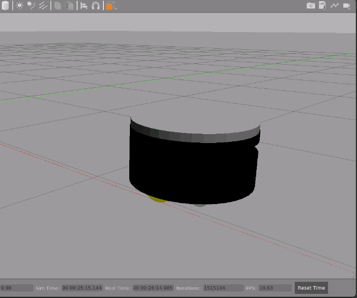

# The rb1_ros2_description package

This package contains a ROS2 robot model description for Robotnik's RB-1 mobile base.

In order to control the robot in the simulation, two different controllers are added to the robot:
        - A **Differential Drive Controller** to control the RB-1's movements.
        - An **Effort Controller** to control the RB-1's elevator.   

## Disclaimer:  
This package only modifies/adapts files from these repositories/packages:  
- [RobotnikAutomation/rb1_base_sim](https://github.com/RobotnikAutomation/rb1_base_sim) licensed under the BSD 2-Clause "Simplified" License
- [RobotnikAutomation/rb1_base_common/rb1_base_description](https://github.com/RobotnikAutomation/rb1_base_common/tree/melodic-devel/rb1_base_description), licensed under the BSD License
- [RobotnikAutomation/robotnik_sensors],(https://github.com/RobotnikAutomation/robotnik_sensors) licensed under the BSD License


## Launch the simulation 

The following command will start the simulation and spawn the robot:
```
ros2 launch rb1_ros2_description rb1_ros2_xacro.launch.py
```


The previous launch file also loads both the `joint_state_broadcaster` and `diffbot_base_controller`.
To check if the controllers are being loaded correctly, run:
```
ros2 control list_controllers
```
The two controllers should be stated as active.


## Move the robot:

### Command to move the robot using the keyboard:
```
ros2 run teleop_twist_keyboard teleop_twist_keyboard --ros-args --remap /cmd_vel:=/diffbot_base_controller/cmd_vel_unstamped
```

### Send Twist commands directly to the robot:

It is possible to control both linear and angular velocities by publishing messages in the `diffbot_base_controller/cmd_vel_unstamped` topic.

For example, this command will make the robot turn around the Z-axis:
```
ros2 topic pub --rate 10 diffbot_base_controller/cmd_vel_unstamped geometry_msgs/msg/Twist "{linear: {x: 0.0, y: 0, z: 0.0}, angular: {x: 0.0,y: 0.0, z: 0.2}}"
```

To stop the robot, publish a message with zero velocities:
```
ros2 topic pub --once diffbot_base_controller/cmd_vel_unstamped geometry_msgs/msg/Twist "{linear: {x: 0.0, y: 0, z: 0.0}, angular: {x: 0.0,y: 0.0, z: 0.0}}"
```

## Control the elevator

### Load the elevator controller 
After launching the simulation, it is possible to load the elevator's controller via the following command: 
```
ros2 control load_controller --set-state start effort_controllers
```
*Please note that the maximum effort command that can be sent to the elevator joint is **10.0** 
to move it up, and the minimum one is **0.0** to move it down.*

### Command to move the elevator up
```
ros2 topic pub /effort_controllers/commands std_msgs/msg/Float64MultiArray "data: [10.0]" --once
```

### Command to move the elevator down
```
ros2 topic pub /effort_controllers/commands std_msgs/msg/Float64MultiArray "data: [0.0]" --once
```



